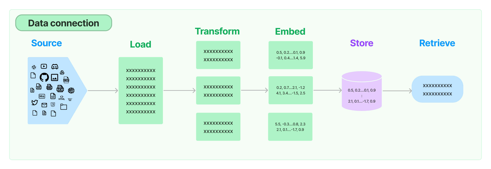
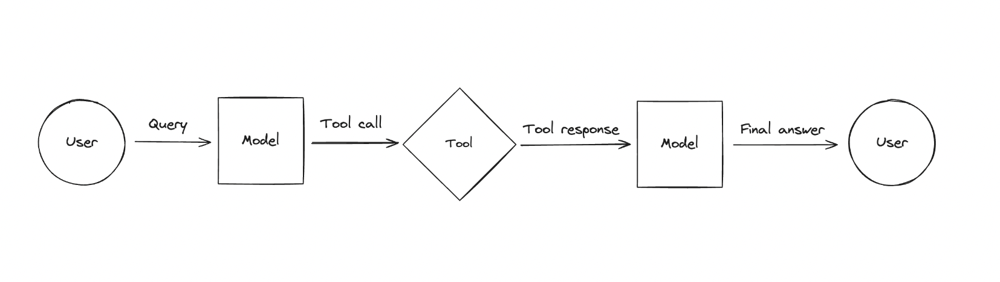
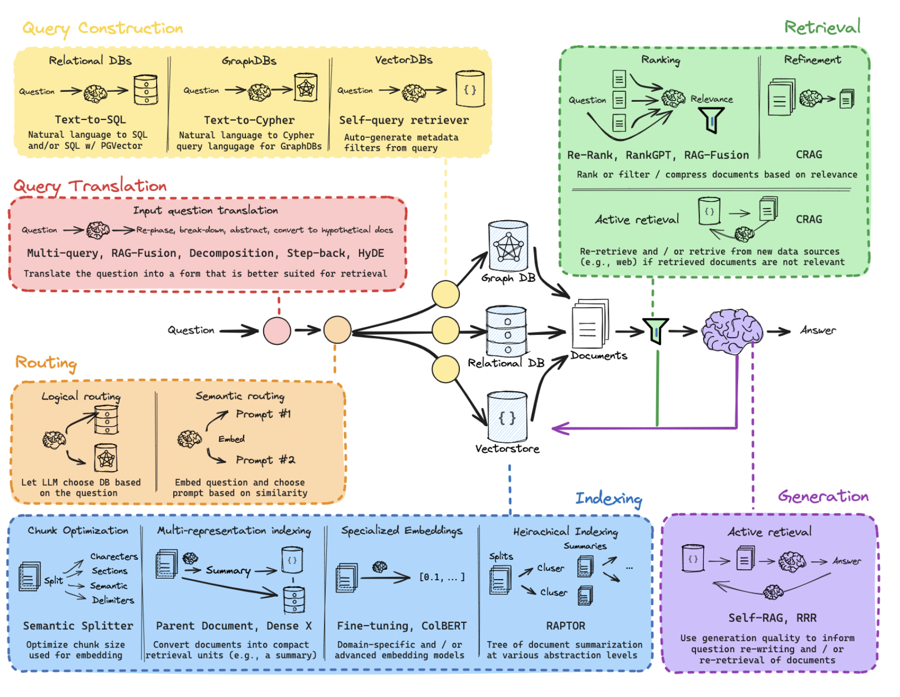
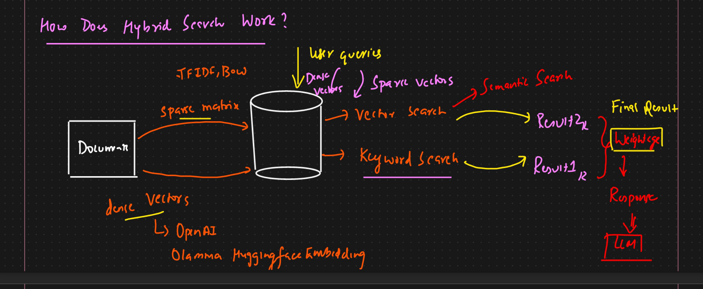
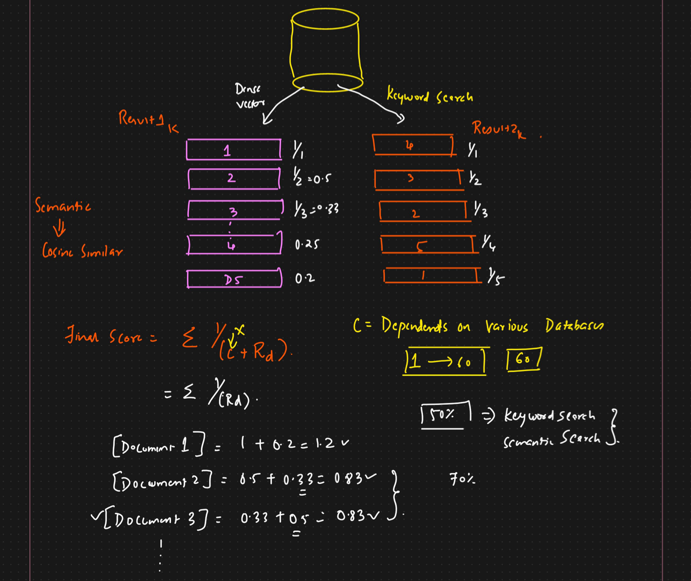
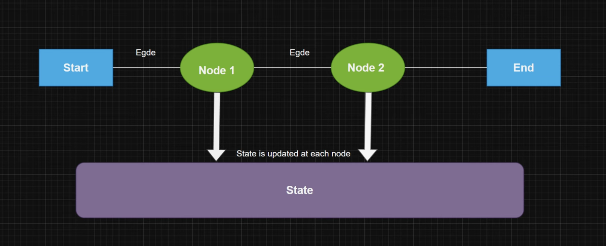

## What is LLM ?
Imagine LLMs as super-smart text tools that have read massive amounts of text (like books, websites, and articles) and learned how to predict words and understand language patterns. These models can perform a wide variety of tasks, such as answering questions, writing essays, translating languages, and even holding conversations.

## LLM VS Generative AI 

| **Feature**               | **LLM (Large Language Model)**                           | **Generative AI**                              |
|---------------------------|---------------------------------------------------------|------------------------------------------------|
| **Definition**             | A type of AI model focused on understanding and generating human language. | A broad category of AI that creates new content like text, images, music, and more. |
| **Scope**                  | Specifically designed for language-related tasks.        | Encompasses content generation across various media (text, images, sound, video).   |
| **Focus**                  | Text generation (e.g., conversations, coding, summaries).| Can generate text, images, videos, music, etc.  |
| **Training Data**          | Trained on massive datasets of text (e.g., books, articles, websites). | Trained on various types of data depending on the task (text, images, audio, etc.). |
| **Examples**               | ChatGPT, Google’s BERT, OpenAI Codex                     | DALL·E (image generation), MuseNet (music creation), deepfakes (video generation).   |
| **Content Type**           | Generates and understands text-based content.            | Generates different types of content such as text, images, music, and video.         |
| **Use Cases**              | Writing, summarizing, answering questions, language translation, coding. | Creating artwork, composing music, generating videos, designing virtual worlds.      |
| **Relation**               | A subset of Generative AI specialized in language.       | A broader category that includes LLMs as one component.                             |


## [Prompt Engineering](https://platform.openai.com/docs/guides/prompt-engineering)
Generic prompt blueprint:
- Act as a XYZ Expert
- I will give you the ABC in the next message
- Exact thing you want (number, thoughts)
- Use the following example
- Words, format & specification

Zero-Shot Prompting:
Zero-shot prompting involves providing a model with a task description and asking it to perform the task without any additional training data. The model relies on its pre-trained knowledge and understanding of language to generate a response.

Few-Shot Prompting:
Few-shot prompting provides the model with a few examples (typically 2-10) of the desired output for a specific task, along with a task description. This helps the model understand the task requirements and generate better responses.

```
Input:
Task: Write a product review.
Examples:
"This phone is amazing! The camera quality is superb."
"The laptop's battery life is impressive, but the keyboard feels cheap."
```


[Chat GPT Prompt library](https://platform.openai.com/docs/examples)
[Anthropic Prompt library](https://docs.anthropic.com/en/prompt-library/library)

[](https://www.youtube.com/watch?v=yu27PWzJI_Y)

## What is Langchain ?

[](https://www.youtube.com/watch?v=ldBsvhjEREc)

### LLMs and Chat Models

| **Characteristics** | **Large Language Models (LLMs)** | **Chat Models** |
| --- | --- | --- |
| **Purpose** | Versatile models for various language tasks | Specialized models for conversational use |
| **Examples of Tasks** | Translation, Summarization, Question Answering, Content Creation | Chatbots, Virtual Assistants, Customer Support Systems |
| **How they Work** | Pre-trained on large data, fine-tuned for specific tasks | Often backed by LLMs, tuned for conversational responses |
| **Input and Output** | Perform various tasks | Take chat messages as input, return AI message as output |

### [Chat Model Messages](https://python.langchain.com/v0.1/docs/modules/model_io/chat/)
- Message Structure
  - Role: Describes who is saying the message (e.g., human, AI, system)
  - Content: Describes the message content (string, list of dictionaries)
  - Additional_kwargs: Additional information about the message (provider-specific)

- Message Types
  - HumanMessage: User-generated message
  - AIMessage: Model-generated message (may include additional_kwargs)
  - SystemMessage: System-generated message (tells model how to behave)
  - FunctionMessage: Result of a function call (includes function name)
  - ToolMessage: Result of a tool call (includes tool call ID)

```python
from langchain import (
    HumanMessage,
    AIMessage,
    SystemMessage,
    FunctionMessage,
    ToolMessage
)


# HumanMessage example
human_msg = HumanMessage(content="Hello, how are you?")
print(human_msg)


# AIMessage example
ai_msg = AIMessage(content="I'm doing well, thanks!", additional_kwargs={"tool_calls": ["search"]})
print(ai_msg)


# SystemMessage example
system_msg = SystemMessage(content="You are a programmer")
print(system_msg)


# FunctionMessage example
func_msg = FunctionMessage(content="Result: 42", name="calculate_answer")
print(func_msg)


# ToolMessage example
tool_msg = ToolMessage(content="Search results:", tool_call_id="search_123")
print(tool_msg)
```

### [Prompt Template in LangChain](https://python.langchain.com/v0.1/docs/modules/model_io/prompts/quick_start/)

Prompt templates are pre-designed formats that help you ask questions or provide tasks to language models. They ensure you get accurate and relevant responses.

1. PromptTemplate
Base class for all prompt templates. Defines the structure for generating prompts.

There are 2 way to create prompt:
```python
from langchain_core.prompts import PromptTemplate

prompt_template = PromptTemplate.from_template(
    "Tell me a {adjective} joke about {content}."
)
prompt_template.format(adjective="funny", content="chickens")
```
Using template parameters
```python
from langchain import PromptTemplate

# Define template string
template = "Answer the following {question} with a detailed explanation."

# Define input variables
input_variables = ["question"]

# Create PromptTemplate
prompt_template = PromptTemplate(
    template=template,
    input_variables=input_variables
)
```

2. ChatPromptTemplate
Template for chat-based prompts. Includes conversation history and context.
```python
from langchain_core.prompts import ChatPromptTemplate

chat_template = ChatPromptTemplate.from_messages(
    [
        ("system", "You are a helpful AI bot. Your name is {name}."),
        ("human", "Hello, how are you doing?"),
        ("ai", "I'm doing well, thanks!"),
        ("human", "{user_input}"),
    ]
)

messages = chat_template.format_messages(name="Bob", user_input="What is your name?")
```
3. ChatMessagePromptTemplate
Specific template for chat messages. Formats messages for language models.

```python
from langchain import ChatMessagePromptTemplate

template = ChatMessagePromptTemplate(
    template="{role}: {content}.",
    role="Assistant"
)

prompt = template.format(content="I'm here to help!")
print(prompt)
# Output: Assistant: I'm here to help!
```

4. Message Prompt Templates
LangChain offers various MessagePromptTemplate types to create specific message prompts:
Common Types
- AIMessagePromptTemplate: Creates AI-generated messages.
- SystemMessagePromptTemplate: Creates system-generated messages.
- HumanMessagePromptTemplate: Creates human-generated messages.


5. MessagesPlaceholder
MessagesPlaceholder gives you control over messages rendered during formatting.
- Benefits :
  - Flexibility: Uncertain role? Insert messages dynamically.
  - Customization: Insert lists of messages during formatting.
- Use Cases
  - Dynamic message insertion
  - Role uncertainty
  - Custom message lists

```python
template = PromptTemplate(template="...", messages_placeholder=MessagesPlaceholder())
prompt = template.format(messages=[message1, message2])
```

### Where to use format ,format_messages & from_template

1. `format()` 
 Usage: Replace placeholders in the template with specific values.

```python
template = AIMessagePromptTemplate(
    template="Translate '{content}' from English to Spanish."
)
prompt = template.format(content="Hello, how are you?")
```
2. `format_messages()`
Usage: Replace placeholders with multiple messages.

```python
template = ChatMessagePromptTemplate(
    template="{role}: {content}"
)
messages = [
    {"role": "User", "content": "Hello"},
    {"role": "AI", "content": "Hi!"}
]
prompt = template.format_messages(messages)
```
3. `from_template()`
Usage: Create a new template from an existing one.

```python
base_template = AIMessagePromptTemplate(
    template="Translate '{content}' from English to Spanish."
)
new_template = AIMessagePromptTemplate.from_template(
    base_template, template="Translate '{content}' from Spanish to French."
)
```

### [Few-shot prompt](https://python.langchain.com/v0.1/docs/modules/model_io/prompts/few_shot_examples/)
A few-shot prompt is a type of prompt that provides a limited number of examples (typically 2-5) of the desired output, along with a clear instruction or task. This approach enables language models to understand the context and generate high-quality responses.
```
**Task:** Write a short story about a character who discovers a hidden world.

**Examples:**

1. Alice fell down the rabbit hole and found Wonderland.
2. Dorothy Gale discovered Oz after a tornado.

**Your turn:** Write a similar story about a character named Max.
```
```python

example_prompt = PromptTemplate(
    input_variables=["task", "examples"],
    template="{examples}\nTask: {task}\n",
)

from langchain_core.prompts.few_shot import FewShotPromptTemplate

prompt = FewShotPromptTemplate(
    examples=examples,
    example_prompt=example_prompt,
    suffix="Question: {input}",
    input_variables=["input"],
)

prompt.format(input="Write a humorous poem about a Toast.")
```
### [Output Parser](https://python.langchain.com/docs/concepts/#output-parsers)

`Output parser` is responsible for taking the output of a model and transforming it to a more suitable format for downstream tasks.

[Output parser Tools documentation](https://python.langchain.com/v0.1/docs/modules/model_io/output_parsers/types/json/)

```python
from langchain_core.output_parsers import JsonOutputParser
from langchain_core.prompts import PromptTemplate
from langchain_openai import ChatOpenAI

output_parser = CommaSeparatedListOutputParser()

format_instructions = output_parser.get_format_instructions()
prompt = PromptTemplate(
    template="Generate a table with 5 rows and columns: {column1}, {column2}, {column3}. List {number} {subject}.\n{format_instructions}",
    input_variables=["subject", "number", "column1", "column2", "column3"],
    partial_variables={"format_instructions": format_instructions},
)

model = ChatOpenAI(temperature=0)

chain = prompt | model | output_parser

response = chain.invoke({
    "subject":"ice cream flavors",
    "number":5,
    "column1":"Flavor",
    "column2":"Type",
    "column3":"Calories"
})
print(response)
```

## [Data ingestion (Retrieval)](https://python.langchain.com/v0.1/docs/modules/data_connection/)


- Loader
- Text splitter
- Embedding
- Vector store
- Retrievers
- Indexing

### Contextual compression
While retriving data from a  vector store we get the document with with a lot of irrelevant text contextual compression helps to fix this.

The idea is simple: instead of immediately returning retrieved documents as-is, you can compress them using the context of the given query, so that only the relevant information is returned. “Compressing” here refers to both compressing the contents of an individual document and filtering out documents wholesale.

```python
from langchain_openai import OpenAI
from langchain_community.document_loaders import TextLoader
from langchain_community.vectorstores import Chroma
from langchain_openai import OpenAIEmbeddings
from langchain_text_splitters import CharacterTextSplitter
from langchain.retrievers import ContextualCompressionRetriever
from langchain.retrievers.document_compressors import LLMChainExtractor

def pretty_print_docs(docs):
    print(
        f"\n{'-' * 100}\n".join(
            [f"Document {i+1}:\n\n" + d.page_content for i, d in enumerate(docs)]
        )
    )

documents = TextLoader("./speech.txt").load()
text_splitter = CharacterTextSplitter(chunk_size=1000, chunk_overlap=0)

docs = text_splitter.split_documents(documents)
embeddings = OpenAIEmbeddings()
vectordb = Chroma.from_documents(docs,embeddings)
retriever = vectordb.as_retriever(search_kwargs={"k": 1})

query = "What is the difference between HTTP and HTTPS?"

llm = OpenAI(temperature=0)
compressor = LLMChainExtractor.from_llm(llm)
compression_retriever = ContextualCompressionRetriever(
    base_compressor=compressor, base_retriever=retriever
)

compressed_docs = compression_retriever.invoke(query)
pretty_print_docs(compressed_docs)
```

## [Chain (Langchain Express Query Language)](https://python.langchain.com/v0.1/docs/modules/chains/)
A way to write instructions for LangChain, a powerful AI tool.

- Runnable interface: A basic building block that allows instructions to be executed.
    Runnable is a subclass of ChainComponent and defines the interface for components that can be executed in a LangChain chain.

    Key Characteristics
    - Executable: Runnable components can be executed with input data.
    - Chainable: Runnable components can be linked together to form a chain.
    - Modular: Runnable components are self-contained and modular.

    Types of Runnables
    - LangChain provides several types of Runnable components:
        - LLM (Large Language Model): Generates text based on input.
        - Retriever: Retrieves context or knowledge from a database.
        - Processor: Processes input data, performs computations.
        - Passthrough: Passes input unchanged to the next component
- `PromptTemplate` and `ChatPromptTemplate`: Two types of instructions that can be executed.
- Supported calls: These instructions can be used in different ways:
    - Invoke: Run the instruction once and get a single answer.
    - Ainvoke (Async Invoke): Run the instruction in the background and get the answer later.
    - Stream: Get multiple answers, one after another, like a continuous stream.
    - Astream (Async Stream): Get multiple answers in the background, like a continuous stream.
    - Batch: Run multiple instructions at once and get all answers together.
    - Abatch (Async Batch): Run multiple instructions in the background and get all answers later.
    - Astream_log: Get multiple answers, like a stream, but also log (record) each answer.


## RAG chain components

1. Retriever: The Librarian
Imagine a librarian who searches for relevant books (information) in a vast library (external knowledge sources). The retriever's job is to:
Find relevant information related to the user's question.
Fetch this information from various sources (e.g., PDF documents, databases).
Provide this information to the next step in the chain.
2. Ranker: The Filter
The ranker acts like a filter, sorting the retrieved information by relevance:
Determines which pieces of information are most useful.
Ranks them in order of importance.
Ensures the most relevant information is used to answer the user's question.
3. Generator: The Answer Writer
The generator takes the ranked information and writes a clear, concise answer:
Uses the retrieved and ranked information to generate a response.
Ensures the answer is relevant, accurate, and easy to understand.
Provides the final answer to the user.
4. History Awareness: The Memory Keeper
History awareness keeps track of the conversation history:
Remembers previous questions and answers.
Understands the context of the conversation.
Helps the retriever and generator provide more accurate and relevant responses.
Think of it like a conversation with a friend:
Retriever: "Hey, I found some info about that!"
Ranker: "Let me sort it out and prioritize the important stuff."
Generator: "Here's the answer!"
History Awareness: "Remember, we were just talking about this related topic."
Together, these components work together to provide accurate, informative, and contextually relevant responses!

## Tools & Agents
Tools are interfaces that an agent, chain, or LLM can use to interact with the world.

In LangChain, *tools* are pre-built components that simplify building AI-powered language applications. 

Think of them as a toolbox for:
- Text processing
- Language understanding
- Response generation
- Conversation management
Examples of tools include:
- Text classification
- Sentiment analysis
- Translation
- Summarization
- These tools make development easier and faster.

In LangChain, an *agent* is a program that:
- Interacts with language models
- Performs specific tasks
- Uses LangChain tools
Types of agents:
- LLaMA Agent (conversational, text generation)
- Plugin Agent (integrates external services/APIs)

Think of an agent as a virtual assistant that automates tasks and enhances language model capabilities.

## Text summarization
- If content fits in llm context window we can pass it directly to llm.
- If content doesn't fits in llm context window we can apply these two common approaches for this are:

    - `Stuff`: Simply "stuff" all your documents into a single prompt. This is the simplest approach .

    - `Map-reduce` (Larger file): Summarize each document on its own in a "map" step and then "reduce" the summaries into a final summary.
        * Single prompt template
        * Multi prompt template
    - `Refine`
    


[Documentation](https://python.langchain.com/docs/tutorials/summarization/#concepts)




[Documentation](https://js.langchain.com/v0.2/docs/concepts/#langsmith)

## Hybrid search
- Combine multiple search technique
    - Semantic search: Dence vector search -> similarity search
        - Understands context, intent, and meaning
        - Uses AI models (e.g., transformers)
        - Captures nuances and relationships
        - Good for complex queries
    - Syntatic/Keyword search: Exact search -> sparse vector search (OHE, BWO, TFIDF etc..)
        - Uses keywords, tags, or metadata
        - Matches exact words or phrases

Hybrid search combines the efficiency of keyword search to initially filter results with the contextual understanding of semantic search to rerank and refine those results, delivering more accurate and relevant information



*How keyword & Semantic search merge ?*
- Keyword & semantic search merge by using *Reciprocal Rank Fusion* .



## Graph Database

Knowledge graph:

A knowledge graph is like a massive, interactive mind map that visually represents relationships between:
- Entities (people, places, things)
- Concepts (ideas, events, topics)
- Relationships (connections between entities and concepts)

Here NLP  plays a crucial role in defining relationships within knowledge graphs.

[](https://www.youtube.com/watch?v=y7sXDpffzQQ)

Three main component:
- Node (Object, places, Person)
- Edges (Relationship between nodes)
- Label (What kind of relationship)

| **Database Type** | **RDBMS** | **Vector DB** | **Graph DB** |
| --- | --- | --- | --- |
| **Schema** | Fixed | Flexible | Flexible |
| **Scalability** | Limited | High | High |
| **Query Language** | SQL | Custom | Cypher/Gremlin |
| **Relationship Handling** | Limited | Efficient | Efficient |
| **Insertion** | Column -> Rows |  | Nodes |
| **Constrains** | Primary,foreign,candidate key |  | Relationship |
| **Data population** | Join query |  | traversal |
| **Use Cases** | Transactional, structured data | Similarity search, ML | Complex relationships, networks |

#### Vector Databases

##### Pros
* Efficient similarity search and nearest-neighbor queries
* Scalability for large datasets
* Flexible schema-less design
* Optimized for machine learning and AI workloads

##### Cons
* Limited support for transactions and concurrency
* Query language limitations (no SQL)
* Requires specialized indexing and caching

#### Graph Databases

##### Pros
* Efficient storage and querying of complex relationships
* Flexible schema-less design
* Scalability for large datasets
* Supports advanced querying languages (Cypher, Gremlin)

##### Cons
* Steeper learning curve
* Limited support for transactions and concurrency
* Requires specialized indexing and caching


**Examples:**
* RDBMS: MySQL, PostgreSQL, Oracle, Microsoft SQL Server
* Vector DB: Pinecone, Weaviate, Qdrant, Annoy
* Graph DB: Neo4j, Amazon Neptune, ArangoDB, OrientDB

### Cypher Query Neo4j

## LLM Finetuning
### RAG VS Finetuning
[](https://www.youtube.com/watch?v=00Q0G84kq3M)

### <u>Quantization:</u>

Conversion from higher memory format to lower memory format is called Quantization

Quantization reduces the precision of neural network weights and activations from floating-point numbers (e.g., float32) to lower-precision integers (e.g., int8). This compression technique decreases memory usage and computational requirements.

- Memory constraints: Reduced memory footprint enables deployment on edge devices with limited resources.
- Computational efficiency: Lower-precision operations accelerate computations on specialized hardware.
- Energy efficiency: Quantized models consume less power.


- Because of quantization memory loss may happen as we reducing the size.

### <u>Common Data Types</u>
1) FP16 quantization
1) BF16 quantization
3) INT8 quantization
- [0,.....,1000] -> 32bit (Number)convert it to [0,....,255] -> 8bit (uint8)


[Medium blog: Quantization Overview](https://medium.com/@abonia/llm-series-quantization-overview-1b37c560946b)

[maartengrootendorst blog: Quantization Overview](https://newsletter.maartengrootendorst.com/p/a-visual-guide-to-quantization)

- Symmetric Quantization
    - symmetric quantization uses a uniform scale centered around zero
- Asymmetric Quantization
    - asymmetric quantization uses a non-uniform scale with an offset zero. Asymmetric quantization is more accurate for activations but harder to implement.

### <u>Calibration</u>
- Calibration is the process of adjusting the quantization parameters to minimize the difference between the original floating-point model and the quantized model. 

### <u>Post-Training Quantization (PTQ)</u>

 Reduce neural network precision from floating-point to integers after training.

PTQ Workflow:
- Training: Train the model using floating-point numbers.
- Statistics collection: Gather activation and weight statistics.
- Quantization: Convert model to lower-precision integers.


GGML and GPTQ are both quantized models designed to reduce model complexity and computational requirements by using lower-precision model weights

| Feature          | GGML                         | GPTQ                         |
|:----------------|:---------------------------|:---------------------------|
| Focus           | Matrix linearization       | Product quantization       |
| Accuracy        | Higher                      | Competitive                 |
| Memory Reduction| Moderate                    | Higher                      |
| Complexity      | Moderate                    | Lower                       |
| Quantization Scheme| Linear transformation     | Product of lower-precision matrices|
| Hardware Support | Various                    | Hardware-friendly           |
| Application     | Edge AI, Computer Vision, NLP| Edge AI, Computer Vision, NLP|

### <u>Quantization-Aware Training (QAT)</u>
PTQ have some problem (Loss of data & accuracy) thats why QAT introduce
 
QAT is a training procedure that simulates quantization effects during training, allowing the model to adapt to quantization errors.


### LoRA & QLoRA
[LoRA: Low-Rank Adaptation of Large Language Models](https://arxiv.org/pdf/2106.09685v2)

[QLoRA: Efficient Finetuning of Quantized LLMs](https://arxiv.org/pdf/2106.09685v2)

Full parameter fine tuning challenges:
- Update model weights (EX: 175 Billion param)
- Hardware resource constrain

LoRA:
- LoRA is a technique to adapt pre-trained models to new tasks or datasets by updating a small set of low-rank matrices.
- Instead of updating weights it track changes

Rank Selection:
To pick low-rank matrices, LoRA typically follows these steps:
- Compute the SVD or eigenvalue decomposition of the weight matrix.
- Retain the top-k singular values or eigenvalues (and their corresponding singular vectors or eigenvectors).
- Discard the remaining dimensions.


QLoRA:
- QLoRA combines LoRA with quantization, adapting pre-trained models while reducing precision

[](https://www.youtube.com/watch?v=t1caDsMzWBk)

[](https://www.youtube.com/watch?v=dA-NhCtrrVE)

Fine tunning llm steps:
- Load and Prepare the Dataset
-  Preprocess the Data (Tokenize the dataset using the tokenizer associated with the pre-trained model)
- Set Up the Training Arguments (Specify the hyperparameters and training settings.)
- Initialize the Model (Load the pre-trained model and define the training procedure.)
- Train the Model (Fine-tune the pre-trained model on your specific dataset.)
- Evaluate the Model (Assess the model's performance on a validation set.)
- Save the Fine-Tuned Model & Use it

### Langgraph

A tool for building stateful, multi-actor applications with LLM.

Core benefits:
- State management & agent coordination
- Cycles: Supports cyclic workflows, essential for agentic architectures.
- Controllability: Fine-grained control over application flow and state.
- Persistence: Built-in persistence for human-in-the-loop and memory features
- Fault tolerance




